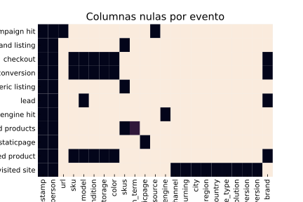
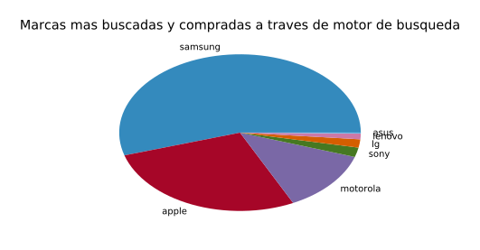
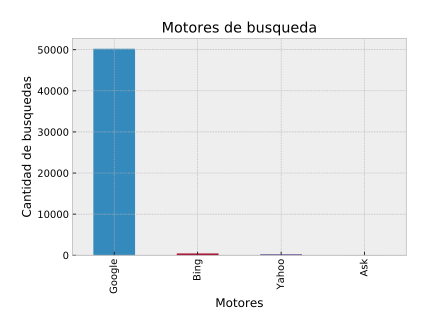
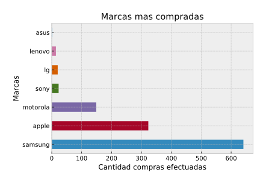
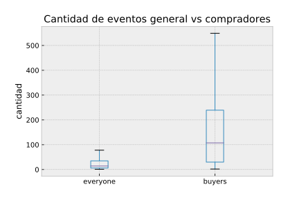
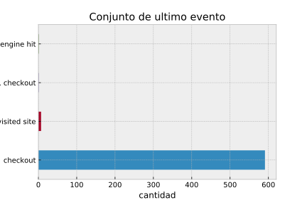
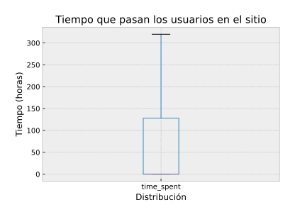

---
papersize:     A4
margin-left:   0.5in
margin-right:  0.5in
margin-top:    0.5in
margin-bottom: 0.5in
...

    <h1>Informe TP1</h1>
    <h2>Grupo null</h2>
    <ul>
        <li>Carlos Talavera</li>
        <li>Federico Jure</li>
        <li>Juan Pablo Capurro</li>
    </ul>

# Introducción 

## Pre-análisis del sitio

Lo primero que hicimos antes de empezar a análizar el set de datos fue analizar la página de Trocafone a ver como podíamos relacionar los tipos de datos, de donde surgian y cómo.

Sabiamos que teniamos un campo _person_ en el set de datos, pero no sabiamos de dónde surgia este ID. Si estaba relacionado con una cuenta de la página, o si estaba relacionado con la sesión del navegador. Una de las primeras cosas que notamos al sumergirnos en la página es que no contaba con un sistema de login. Entonces nos surgió la siguiente pregunta: ¿De dónde salía este ID?.
Evidentemente, el evento de una única persona podría estar asociado a varios ID's distintos, ya que dependia del dispositivo del cuál estuviese usando la persona. A grandes rasgos, no representa ninguna desventaja a la hora de hacer análisis globales, pero perdíamos pequeños datos relacionados con los movimientos de las personas y podrian surgir algunas inconsistencias en el set de datos como por ejemplo: Una persona podria entrar a comprar un producto directamente sin pasar previamente por un motor de busqueda o una campaña publicitaria, entrando al link del producto directamente. Esto podria pasar cuando una persona ingresa por un dispositivo y se reenvia el link del producto y termina realizand la compra por otro. 
Teniendo en cuenta este tipo de situaciones, es que consideramos no tomar tales eventos como datos anómalos.

## Pre-análisis del set de datos

Al estar todos los eventos en un mismo dataframe, creimos que los eventos iban a tener una cantidad importante de columnas nulas dependiendo del tipo de evento.

Dependiendo del tipo de evento, las columnas son nulas o no en un 100%, con excepción del campo `search_term` en el que hay una pequeña proporción de nulos. En definitiva, podemos decir que este set de datos es bastante consistente en cuanto a los datos de los cuales podemos sacar conclusiones directamente.

Gracias al gráfico de los datos nulos, podemos identificar rápidamente que features relacionar con cuál para sacar conclusiones. 

Por ejemplo, observando el gráfico podemos ver que podemos relacionar directamente el campo _conversion_ con los campos _sku, model, condition y storage_. Es decir, podemos observar si vale la pena sacar conclusiones de las ventas realizadas de acuerdo a sku, el modelo, la condición y el tamaño de la memoria del dispositivo. 
También, nos sirve para descartar ideas que no son factibles directamente. Por ejemplo, no podemos relacionar directamente la cantidad de _conversion_ con el campo _city_ o _region_, ya que todos los tipos de eventos que surgieron como resultado de una compra, no tienen estos campos.

<!-- TODO: Relacionar esos campos propagando los datos de visited_site -->

Este análisis previo de como se relacionan los campos del dataset entre sí nos ahorró bastante tiempo a la hora de saber por qué lado encarar los análisis.

## Nueva feature: Marca del dispositivo

Analizando el set decidimos que podría ser bastante útil e interesante hacer análisis no solo de acuerdo al modelo del dispositivo, sino también de acuerdo a la marca dueña del mismo. 

Esta nueva feature nos permitiría analizar los resultados discriminando por empresas, y no solo por modelo. Por ejemplo evaluar cuál es la empresa de más renombre en la venta de dispositivos usados. La mayoria de las marcas tienen varios modelos. Y esta nueva feature nos permitira tener una visión más global de los agentes influyentes en el set de datos.

# Exploracion

## Exploración de tipos de evento por separado

### Eventos de búsqueda
Procedemos a ver si hay registros inválidos de busquedas, y si amerita dropear registros.
Por un lado, hay una proporción importante (7k nulos en 56k total) de eventos de busqueda que tienen `NaN` como `search_term`, pero tienen distintas listas de `skus`, por lo que podemos suponer que hay otros factores que afectan a la busqueda.

### Busquedas por motores

La idea de este análisis era evaluar cuál es el motor de busqueda más usado para llegar a los productos de la página. Al principio, supusimos que el motor de búsqueda más usado iba a ser Google. Dado que es uno de los motores de busquedas más usados a nivel global y este dato es de conocimiento común. Sin embargo, decidimos llevar a cabo este análisis para terminar de confirmar (o no) nuestras hipótesis. Obtuvimos el siguiente resultado:

Tal y como era de esperarse, Google salió en primer lugar, por una diferencia abismal con el resto de los motores. Suponiamos que Google iba a ser el motor de búsqueda más usado, pero no teniamos idea de como iba a ser la relación respecto al uso de los otros motores de busqueda. Suponiamos que al menos el resto de los motores iban a sumar por lo menos un cuarto de las busquedas hechas por Google, pero ni siquiera se acercan. De hecho en el gráfico su presencia respecto a los 50 000 busquedas por Google es despreciable.

Curiosamente, la distribución del ranking se constrasta con este artículo publicado en este [blog](https://www.reliablesoft.net/top-10-search-engines-in-the-world/) y en tantos otros.

Es decir, los motores de busqueda más usados a nivel global son:
* Google
* Bing
* Yahoo
* Ask
  
Lo cuál se refleja exactamente en nuestro análisis, y si nos ponemos a pensar, tiene bastante sentido. Ya que las proporciones a nivel global son relativamente equivalentes cuando lo analizás por tópicos aislados.

### Compras realizadas a traves de busquedas por motores.

Analizando el gráfico que hicimos inicialmente en el preprocesamiento de datos nos dimos cuenta de que no podíamos relacionar directamente a las personas que venian de realizar una busqueda a través de un motor y si terminaban haciendo una compra.
Pero podiamos vincularlos a través del ID haciendo un merge entre ambos eventos. 

Antes de realizar este análisis necesitamos saber cuales son las marcas más compradas, sin tener en cuenta el evento por el cual llegaron a la página. 

Ahora discrinamos aquellos ID's los cuales llegaron por medio de un motor de busqueda, y realizamos el mismo plot:

Lo primero que podemos observar es que no todas las compras efectuadas son realizadas por personas que llegaron a partir de un motor de busqueda. Hay algunas compras hechas por personas que se realizaron y no sabemos a través de donde llegaron. Suponemos que son movimientos realizados de diferentes dispositivos y perdimos la relacion. Además, sabemos que los eventos de campañas publicitarias también disparan los eventos de busquedas a través de motores. (Este dato lo obtuvimos durante el preprocesamiento analizando los timestamp, notamos que en un mismo segundo se realizaban multiples eventos)

Si comparamos ambos análisis, podemos ver que las marcas más vendidas, son las marcas de las cuales tenemos menos registros de donde vinieron, por ejemplo Apple y Samsung. Esto puede deber a dos cosas:

1) Las personas que compran productos de dichas marcas, tardan más en decidirse si comprar el producto, y lo analizan entrando desde distintos dispositivos. Sabemos que Apple y Samsung tienen los modelos de celulares más caros y más vendidos (i.e.:La gama de los Samsung Galaxy y los iphones.)
2) El resultado de que las compras en dichas marcas no tengan como origen una busqueda por navegador es consecuencia del volumen de datos únicamente, y se repite en la misma proporcion para todas las marcas, solo que al ser menores las ventas el fenómeno es menos apreciable.

### Eventos de visita de sitio
Consideramos la resolución de pantalla una forma de ver qué poder adquisitivo tienen las personas que visitan el sitio.
Medimos la cantidad de píxeles de las pantallas, porque hay muchas variantes de resoluciones y solo nos importa el tamaño.

Nos interesó también que proporcion de los usuarios accedian desde mobile y cuántos desde desktop

# Exploracion de los eventos en conjunto
El uso de la plataforma aumentó enormemente a lo largo de los últimos meses:

Hay una aparente caída de la cantidad de eventos en el último mes, pero esto es consecuencia de que los datos para este se encuentran truncados a mitad de mes.

Y la distribución de los eventos a lo largo del dia no nos da muchas sorpresas:

Los usuarios pueden tener una cantidad variable de eventos, y es usual que tengan algunos cientos, con outliers teniendo un par de miles. Estos outliers no aparecen en el gráfico porque lo volverían ilegible.

Los usuarios que realizan una conversión tienen general muchos más eventos que el público en general.

## Exploraciones de los distintos modelos
Encontramos que incluso filtrando aquellos modelos con menos de 100 eventos, buscar cuáles presentaban mejor ratio de leads introducía bastante ruido. Por ejemplo, aparecían modelos sin conversiones, por lo que consideramos esta columna relativamente desestimable.

Por otro lado, encontramos que los modelos con más vistas no overlapean mucho con los que tienen mayor ratio de conversiones:

## Ventas por mes y marca
En general las ventas por marca tienen una distribución algo parecidas al market share de las distintas empresas [a nivel global](https://www.statista.com/statistics/271496/global-market-share-held-by-smartphone-vendors-since-4th-quarter-2009/)

Pero se puede ver que Samsung tiene una parte mas grande de las ventas en la plataforma que a nivel global.

Las ventas por mes muestran que, por un lado, los datos están truncados en el ultimo mes, y que hubo pequeñas fluctuaciones en la proporción de ventas de Motorola respecto a las demás, pero siempre se mantuvo en primer lugar Samsung, seguido de Apple.

## Exploración sobre los usuarios

Pudimos observar que en el caso del primer evento del usuario, se hallan en el mismo segundo varios otros eventos de tipos relacionados, que refieren a la misma accion pero desde distintos puntos de vista:

Por ejemplo, lo más usual es que se llegue a visitar el sitio por un ad campaign hit desde un search engine.

En cuanto a los ultimos eventos de un usuario, estos no suelen aparecer en grupos

### Distribución temporal de los eventos

Los usuarios pasan cantidads de tiempo muy variadas en la plataforma, y se puede destacar que hay una proporción alta de outliers que tienen eventos separados por varios miles de horas. Estos no son mostrados en el gráfico porque lo volverían ilegible.

Por otro lado, no se encontró relación entre el tiempo que un usuario lleva usando el sitio y la cantidad de eventos de algún tipo en particular que genera.

# Insights
