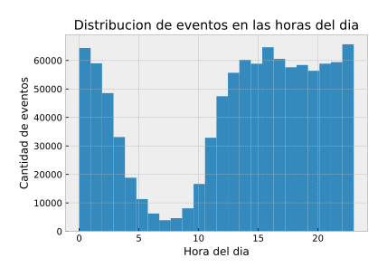
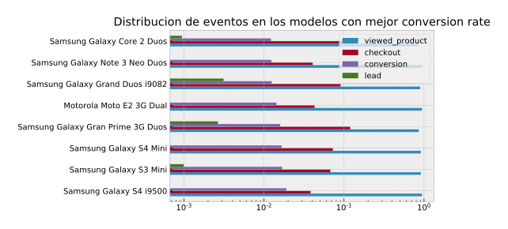

---
papersize:     A4
margin-left:   0.5in
margin-right:  0.5in
margin-top:    0.5in
margin-bottom: 0.5in
...

    <h1>Informe TP1</h1>
    <h2>Grupo null</h2>
    <ul>
        <li>Carlos Talavera</li>
        <li>Federico Jure</li>
        <li>Juan Pablo Capurro</li>
    </ul>

# Introducción 

## Pre-análisis del set de datos

Al estar todos los eventos en un mismo dataframe, creimos que los eventos iban a tener una cantidad importante de columnas nulas dependiendo del tipo de evento.

Dependiendo del tipo de evento, las columnas son nulas o no en un 100%, con excepción del campo `search_term` en el que hay una pequeña proporción de nulos. En definitiva, podemos decir que este set de datos es bastante consistente en cuanto a los datos de los cuales podemos sacar conclusiones directamente.

Gracias al gráfico de los datos nulos, podemos identificar rápidamente que features relacionar con cuál para sacar conclusiones. 

Por ejemplo, observando el gráfico podemos ver que podemos relacionar directamente el campo _conversion_ con los campos _sku, model, condition y storage_. Es decir, podemos observar si vale la pena sacar conclusiones de las ventas realizadas de acuerdo a sku, el modelo, la condición y el tamaño de la memoria del dispositivo. 
También, nos sirve para descartar ideas que no son factibles directamente. Por ejemplo, no podemos relacionar directamente la cantidad de _conversion_ con el campo _city_ o _region_, ya que todos los tipos de eventos que surgieron como resultado de una compra, no tienen estos campos.

Este análisis previo de como se relacionan los campos del dataset entre sí nos ahorró bastante tiempo a la hora de saber por qué lado encarar los análisis.

## Nueva feature: Marca del dispositivo

Analizando el set decidimos que podría ser bastante útil e interesante hacer análisis no solo de acuerdo al modelo del dispositivo, sino también de acuerdo a la marca dueña del mismo. 

Esta nueva feature nos permitiría analizar los resultados discriminando por empresas, y no solo por modelo. Por ejemplo evaluar cuál es la empresa de más renombre en la venta de dispositivos usados. La mayoria de las marcas tienen varios modelos. Y esta nueva feature nos permitira tener una visión más global de los agentes influyentes en el set de datos.1

# Exploracion

## Exploración de tipos de evento por separado

### Eventos de búsqueda
Procedemos a ver si hay registros inválidos de busquedas, y si amerita dropear registros.
Por un lado, hay una proporción importante (7k nulos en 56k total) de eventos de busqueda que tienen `NaN` como `search_term`, pero tienen distintas listas de `skus`, por lo que podemos suponer que hay otros factores que afectan a la busqueda.

### Eventos de visita de sitio
Consideramos la resolución de pantalla una forma de ver qué poder adquisitivo tienen las personas que visitan el sitio.
Medimos la cantidad de píxeles de las pantallas, porque hay muchas variantes de resoluciones y solo nos importa el tamaño.

Nos interesó también que proporcion de los usuarios accedian desde mobile y cuántos desde desktop

## Exploracion de los eventos en conjunto
El uso de la plataforma aumentó enormemente a lo largo de los últimos meses:

Y la distribución de los eventos a lo largo del dia no nos da muchas sorpresas:

Los usuarios pueden tener una cantidad variable de eventos, y es usual que tengan algunos cientos.

## Exploraciones de los distintos modelos
Encontramos que incluso filtrando aquellos modelos con menos de 100 eventos, buscar cuáles presentaban mejor ratio de leads introducía bastante ruido. Por ejemplo, aparecían modelos sin conversiones, por lo que consideramos esta columna relativamente desestimable.

Por otro lado, encontramos que los modelos con más vistas no overlapean mucho con los que tienen mayor ratio de conversiones:

# Insights
