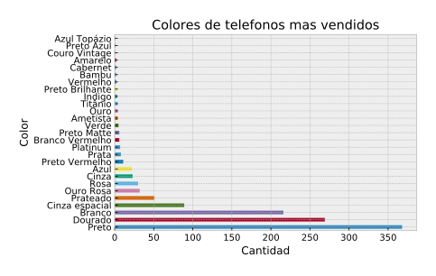

---
papersize:     A4
margin-left:   0.5in
margin-right:  0.5in
margin-top:    0.5in
margin-bottom: 0.5in
...

    <h1>Informe TP1</h1>
    <h2>Grupo null</h2>
    <ul>
        <li>Carlos Talavera</li>
        <li>Federico Jure</li>
        <li>Juan Pablo Capurro</li>
    </ul>

# Introducción

Al estar todos los eventos en un mismo dataframe, creimos que los eventos iban a tener una cantidad importante de columnas nulas dependiendo del tipo de evento.

Efectivamente, dependiendo del tipo de evento, las columnas son nulas o no en un 100%, con excepción del campo `search_term` en el que hay una pequeña proporción de nulos.

# Exploracion

## Exploración de tipos de evento por separado

### Eventos de búsqueda
Procedemos a ver si hay registros inválidos de busquedas, y si amerita dropear registros.
Por un lado, hay una proporción importante (7k nulos en 56k total) de eventos de busqueda que tienen `NaN` como `search_term`, pero tienen distintas listas de `skus`, por lo que podemos suponer que hay otros factores que afectan a la busqueda.

### Eventos de visita de sitio
Consideramos la resolución de pantalla una forma de ver qué poder adquisitivo tienen las personas que visitan el sitio.
Medimos la cantidad de píxeles de las pantallas, porque hay muchas variantes de resoluciones y solo nos importa el tamaño.

Nos interesó también que proporcion de los usuarios accedian desde mobile y cuántos desde desktop

## Exploracion de los eventos en conjunto
El uso de la plataforma aumentó enormemente a lo largo de los últimos meses:

Y la distribución de los eventos a lo largo del dia no nos da muchas sorpresas:

Los usuarios pueden tener una cantidad variable de eventos, y es usual que tengan algunos cientos.

No encontramos relación entre el tiempo que pasa un usuario en total en el sitio y la cantidad de eventos que genera de ningún tipo

## Exploraciones de los distintos modelos
Encontramos que incluso filtrando aquellos modelos con menos de 100 eventos, buscar cuáles presentaban mejor ratio de leads introducía bastante ruido. Por ejemplo, aparecían modelos sin conversiones, por lo que consideramos esta columna relativamente desestimable.

Por otro lado, encontramos que los modelos con más vistas no overlapean mucho con los que tienen mayor ratio de conversiones:

El color 'negro' es por lejos el mas vendido

# Insights
