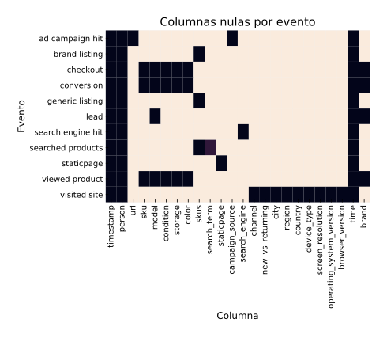
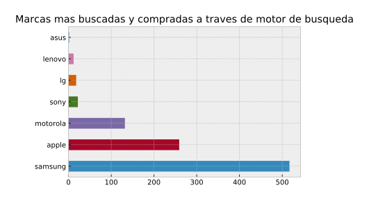
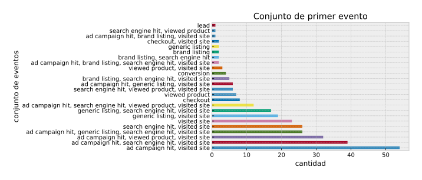
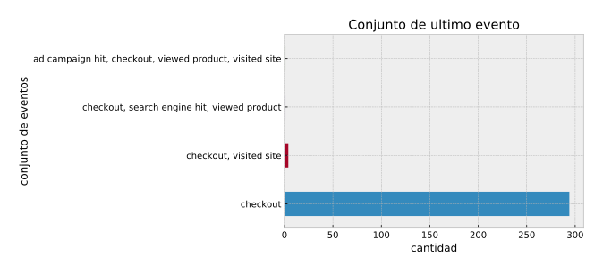
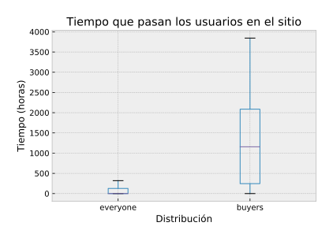
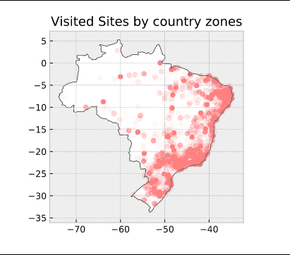

---
papersize:     A4
margin-left:   0.5in
margin-right:  0.5in
margin-top:    0.5in
margin-bottom: 0.5in
title:         .
toc:           true
...

    <h1>Informe TP1</h1>
    <h2>Grupo null</h2>
    <ul>
        <li>Carlos Talavera</li>
        <li>Federico Jure</li>
        <li>Juan Pablo Capurro</li>
    </ul>
    <ul>
    <li><b>Git repo: </b> <a href="https://github.com/juanpcapurro/tp_datos_2c2018">https://github.com/juanpcapurro/tp_datos_2c2018</a> </li>
    </ul>

# Introducción 

## Pre-análisis del sitio

Lo primero que hicimos antes de empezar a analizar el set de datos fue analizar la página de Trocafone para ver cómo podíamos relacionar los tipos de datos, de donde surgían y cómo.

Sabíamos que teníamos un campo _person_ en el set de datos, pero no sabíamos de dónde surgía este ID.
Si estaba relacionado con una cuenta de la página, o si estaba relacionado con la sesión del navegador.

Una de las primeras cosas que notamos al sumergirnos en la página es que no contaba con un sistema de login.
Entonces nos surgió la siguiente pregunta: ¿De dónde salía este ID?.
Evidentemente, el evento de una única persona podría estar asociado a varios ID's distintos, ya que dependía del dispositivo del cuál estuviese usando.

A grandes rasgos, no representa ninguna desventaja a la hora de hacer análisis globales, pero perdíamos pequeños datos relacionados con los movimientos de las personas y podrían surgir algunas particularidades en el set de datos como por ejemplo: Una persona podría entrar a comprar un producto directamente sin pasar previamente por un motor de búsqueda o una campaña publicitaria, entrando al link del producto.

## Pre-análisis del set de datos

Al estar todos los eventos en un mismo dataframe, creímos que los eventos iban a tener una cantidad importante de columnas nulas dependiendo del tipo de evento.

Dependiendo del tipo de evento, las columnas son nulas o no en un 100%, con excepción del campo `search_term` en el que hay una pequeña proporción de nulos.
En definitiva, podemos decir que este set de datos es bastante consistente en cuanto a los datos de los cuales podemos sacar conclusiones directamente.

Gracias al gráfico de los datos nulos, podemos identificar rápidamente que features relacionar con cuál para sacar conclusiones. 

Por ejemplo, observando el gráfico podemos ver que podemos relacionar directamente el campo _conversion_ con los campos _sku, model, condition y storage_.
Es decir, podemos observar si vale la pena sacar conclusiones de las ventas realizadas de acuerdo a sku, el modelo, la condición y el tamaño de la memoria del dispositivo.

También, nos sirve para descartar ideas que no son factibles directamente.
Por ejemplo, no podemos relacionar directamente la cantidad de _conversion_ con el campo _city_ o _region_, ya que todos los tipos de eventos que surgieron como resultado de una compra, no tienen estos campos.

En una [seccion posterior][propagacion de datos de eventos] se verá más en detalle cómo relacionar estos registros.

## Nueva feature: Marca del dispositivo

Analizando el set decidimos que podría ser bastante útil e interesante hacer análisis no solo de acuerdo al modelo del dispositivo, sino también de acuerdo a la marca dueña del mismo. 

Esta nueva feature nos permitiría analizar los resultados discriminando por empresas, y no solo por modelo.
Por ejemplo evaluar cuál es la empresa de más renombre en la venta de dispositivos usados.
La mayoría de las marcas tienen varios modelos.
Y esta nueva feature nos permitirá tener una visión más global de los agentes influyentes en el set de datos.

# Exploración

## Exploración de tipos de evento por separado

### Eventos de búsqueda
Procedemos a ver si hay registros inválidos de búsquedas, y si amerita dropear registros.
Por un lado, hay una proporción importante (7k nulos en 56k total) de eventos de búsqueda que tienen `NaN` como `search_term`, pero tienen distintas listas de `skus`, por lo que podemos suponer que hay otros factores que afectan a la búsqueda.

### Eventos de visita de sitio
<!--TODO: mover esto a donde se propagan los eventos y relacionar la resolucion con las compras-->
Consideramos la resolución de pantalla una forma de ver qué poder adquisitivo tienen las personas que visitan el sitio.
Medimos la cantidad de pídeles de las pantallas, porque hay muchas variantes de resoluciones y solo nos importa el tamaño.

Nos interesó también que proporción de los usuarios accedían desde mobile y cuántos desde desktop

Volviendo a las resoluciones de pantalla, mirar el listado nos permite ver cuáles son las mas populares, lo que es congruente con el primer gráfico de este apartado:

La mayoría de las visitas son desde dispositivos con resoluciones de pantalla bajas, lo cual confirma nuestra presuposición de que los usuarios del sitio son de bajo poder adquisitivo, o por lo menos no lo reflejan en los dispositivos que usan para acceder al sitio.

# Exploración de los eventos en conjunto
El uso de la plataforma aumentó enormemente a lo largo de los últimos meses:

Hay una aparente caída de la cantidad de eventos en el último mes, pero esto es consecuencia de que los datos para este se encuentran truncados a mitad de mes.

Y la distribución de los eventos a lo largo del día no nos da muchas sorpresas:

Los usuarios pueden tener una cantidad variable de eventos, y es usual que tengan algunos cientos, con outliers teniendo un par de miles. Estos outliers no aparecen en el gráfico porque lo volverían ilegible.

Los usuarios que realizan una conversión tienen muchos más eventos que el público en general.

## Exploraciones de los distintos modelos
Encontramos que incluso filtrando aquellos modelos con menos de 100 eventos, buscar cuáles presentaban mejor ratio de leads introducía bastante ruido. Por ejemplo, aparecían modelos sin conversiones, por lo que consideramos esta columna relativamente desestimable.

Por otro lado, encontramos que los modelos con más vistas no overlapean mucho con los que tienen mayor ratio de conversiones:

## Ventas por mes y marca
En general las ventas por marca tienen una distribución algo parecidas al market share de las distintas empresas a nivel global [^market-share]

[^market-share]: https://www.statista.com/statistics/271496/global-market-share-held-by-smartphone-vendors-since-4th-quarter-2009/

Pero se puede ver que Samsung tiene una parte mas grande de las ventas en la plataforma que a nivel global.

Las ventas por mes muestran que, por un lado, los datos están truncados en el ultimo mes, y que hubo pequeñas fluctuaciones en la proporción de ventas de Motorola respecto a las demás, pero siempre se mantuvo en primer lugar Samsung, seguido de Apple.

## Exploración sobre los usuarios

Pudimos observar que en el caso del primer evento del usuario, se hallan en el mismo segundo varios otros eventos de tipos relacionados, que refieren a la misma acción pero desde distintos puntos de vista:

Por ejemplo, lo más usual es que se llegue a visitar el sitio por un ad campaign hit desde un search engine.

En cuanto a los últimos eventos de un usuario, estos no suelen aparecer en grupos

### Distribución temporal de los eventos

Los usuarios pasan cantidades de tiempo muy variadas en la plataforma, y se puede destacar que hay una proporción alta de outliers que tienen eventos separados por varios miles de horas. Estos no son mostrados en el gráfico porque lo volverían ilegible.

TODO: rehacer esto sacando los outliers.
Por otro lado, no se encontró relación entre el tiempo que un usuario lleva usando el sitio y la cantidad de eventos de algún tipo en particular que genera.

## Propagacion de datos de eventos
TODO

## Distribucion de los usuarios en el país

